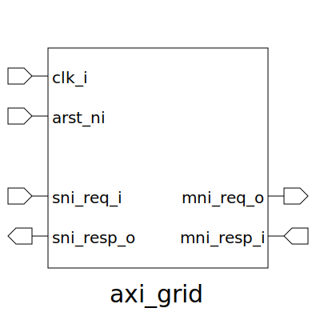

# axi_grid (module)

### Author : Foez Ahmed (foez.official@gmail.com)

## TOP IO

## Description

Write a markdown documentation for this systemverilog module:

## Parameters
|Name|Type|Dimension|Default Value|Description|
|-|-|-|-|-|
|IS_PIPELINED|bit||1||
|sni_req_t|type||axi_default_param_pkg::sni_req_t||
|sni_resp_t|type||axi_default_param_pkg::sni_resp_t||
|mni_req_t|type||axi_default_param_pkg::mni_req_t||
|mni_resp_t|type||axi_default_param_pkg::mni_resp_t||
|NUM_ROW|int||3||
|NUM_COL|int||3||
|NUM_MNI|int||4||
|NUM_SNI|int||3||
|MNI_INDEX|int|[NUM_ROW][NUM_COL]|'{'{0||
|SNI_INDEX|int|[NUM_ROW][NUM_COL]|'{'{-1||

## Ports
|Name|Direction|Type|Dimension|Description|
|-|-|-|-|-|
|clk_i|input|logic|||
|arst_ni|input|logic|||
|sni_req_i|input|sni_req_t|[NUM_SNI]||
|sni_resp_o|output|sni_resp_t|[NUM_SNI]||
|mni_req_o|output|mni_req_t|[NUM_MNI]||
|mni_resp_i|input|mni_resp_t|[NUM_MNI]||
