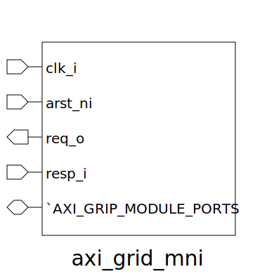

# axi_grid_mni (module)

### Author : Foez Ahmed (foez.official@gmail.com)

## TOP IO

## Description

Write a markdown documentation for this systemverilog module:

## Parameters
|Name|Type|Dimension|Default Value|Description|
|-|-|-|-|-|
|req_t|type||logic||
|resp_t|type||logic||

## Ports
|Name|Direction|Type|Dimension|Description|
|-|-|-|-|-|
|clk_i|input|logic|||
|arst_ni|input|logic|||
|req_o|output|req_t|||
|resp_i|input|resp_t|||
