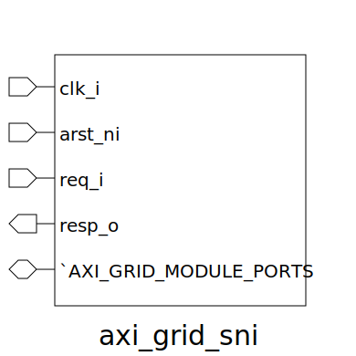

# axi_grid_sni (module)

### Author : Foez Ahmed (foez.official@gmail.com)

## TOP IO

## Description

Write a markdown documentation for this systemverilog module:

## Parameters
|Name|Type|Dimension|Default Value|Description|
|-|-|-|-|-|
|req_t|type||axi_default_param_pkg::sni_req_t||
|resp_t|type||axi_default_param_pkg::sni_resp_t||
|grid_id_t|type||axi_default_param_pkg::grid_id_t||
|grid_aw_chan_t|type||axi_default_param_pkg::grid_aw_chan_t||
|grid_w_chan_t|type||axi_default_param_pkg::grid_w_chan_t||
|grid_b_chan_t|type||axi_default_param_pkg::grid_b_chan_t||
|grid_ar_chan_t|type||axi_default_param_pkg::grid_ar_chan_t||
|grid_r_chan_t|type||axi_default_param_pkg::grid_r_chan_t||
|NI_ID|grid_id_t||0||

## Ports
|Name|Direction|Type|Dimension|Description|
|-|-|-|-|-|
|clk_i|input|logic|||
|arst_ni|input|logic|||
|req_i|input|req_t|||
|resp_o|output|resp_t|||
|`AXI_GRIP_MODULE_PORTS|interface||||
