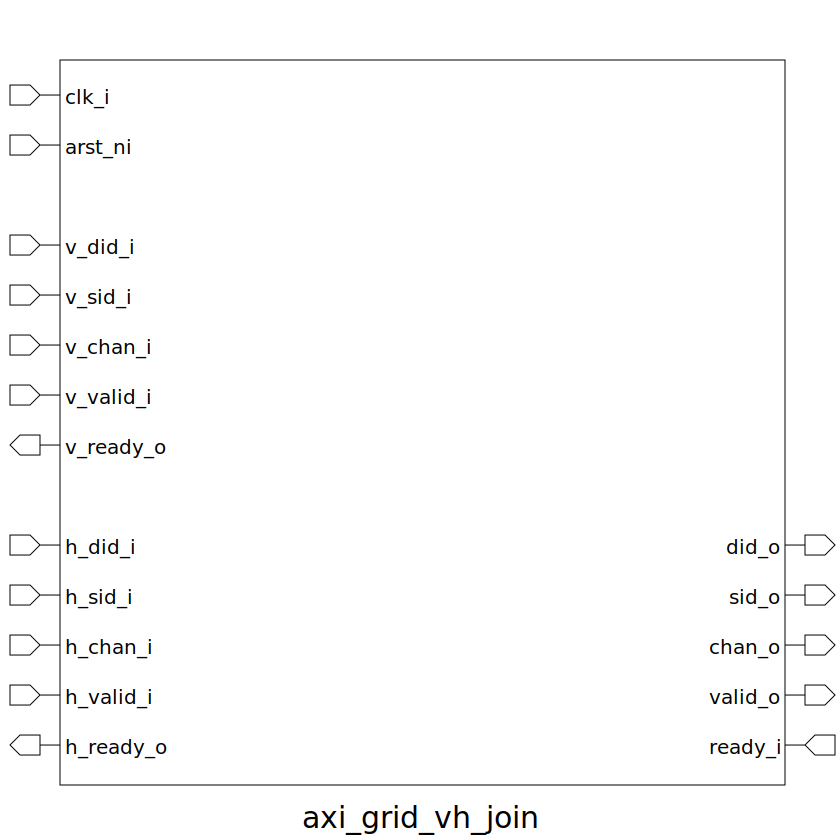

# axi_grid_vh_join (module)

### Author : Foez Ahmed (foez.official@gmail.com)

## TOP IO

## Description

Write a markdown documentation for this systemverilog module:

## Parameters
|Name|Type|Dimension|Default Value|Description|
|-|-|-|-|-|
|grid_id_t|type||axi_default_param_pkg::grid_id_t||
|chan_t|type||axi_default_param_pkg::grid_id_t||
|NI_ID|grid_id_t||0||

## Ports
|Name|Direction|Type|Dimension|Description|
|-|-|-|-|-|
|clk_i|input|logic|||
|arst_ni|input|logic|||
|v_did_i|input|grid_id_t|||
|v_sid_i|input|grid_id_t|||
|v_chan_i|input|chan_t|||
|v_valid_i|input|logic|||
|v_ready_o|output|logic|||
|h_did_i|input|grid_id_t|||
|h_sid_i|input|grid_id_t|||
|h_chan_i|input|chan_t|||
|h_valid_i|input|logic|||
|h_ready_o|output|logic|||
|did_o|output|grid_id_t|||
|sid_o|output|grid_id_t|||
|chan_o|output|chan_t|||
|valid_o|output|logic|||
|ready_i|input|logic|||
