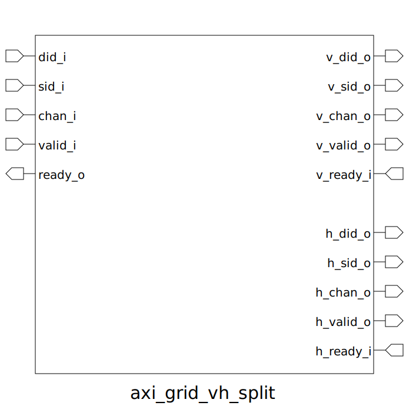

# axi_grid_vh_split (module)

### Author : Foez Ahmed (foez.official@gmail.com)

## TOP IO

## Description

The `axi_grid_vh_split` module is designed to split input signals into vertical and horizontal
channels based on the grid ID. This module is parameterized to allow flexibility in the types of
grid IDs and channels used.

## Parameters
|Name|Type|Dimension|Default Value|Description|
|-|-|-|-|-|
|grid_id_t|type||axi_default_param_pkg::grid_id_t| Type for grid ID, default is `axi_default_param_pkg::grid_id_t`|
|chan_t|type||axi_default_param_pkg::grid_id_t| Type for channel, default is `axi_default_param_pkg::grid_id_t`|
|NI_ID|grid_id_t||'0| Grid ID for the network interface, default is `0`|

## Ports
|Name|Direction|Type|Dimension|Description|
|-|-|-|-|-|
|did_i|input|grid_id_t||Destination ID input|
|sid_i|input|grid_id_t||Source ID input|
|chan_i|input|chan_t||Channel input|
|valid_i|input|logic||Valid signal input|
|ready_o|output|logic||Ready signal output|
|v_did_o|output|grid_id_t||Vertical channel destination ID output|
|v_sid_o|output|grid_id_t||Vertical channel source ID output|
|v_chan_o|output|chan_t||Vertical channel output|
|v_valid_o|output|logic||Vertical channel valid signal output|
|v_ready_i|input|logic||Vertical channel ready signal input|
|h_did_o|output|grid_id_t||Horizontal channel destination ID output|
|h_sid_o|output|grid_id_t||Horizontal channel source ID output|
|h_chan_o|output|chan_t||Horizontal channel output|
|h_valid_o|output|logic||Horizontal channel valid signal output|
|h_ready_i|input|logic||Horizontal channel ready signal input|
